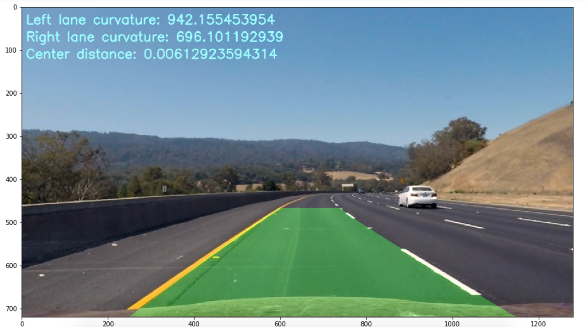

## Writeup Template

---

**Advanced Lane Finding Project**

The goals / steps of this project are the following:

* Compute the camera calibration matrix and distortion coefficients given a set of chessboard images.
* Apply a distortion correction to raw images.
* Use color transforms, gradients, etc., to create a thresholded binary image.
* Apply a perspective transform to rectify binary image ("birds-eye view").
* Detect lane pixels and fit to find the lane boundary.
* Determine the curvature of the lane and vehicle position with respect to center.
* Warp the detected lane boundaries back onto the original image.
* Output visual display of the lane boundaries and numerical estimation of lane curvature and vehicle position.

[//]: # (Image References)

[image1]: ./examples/undistort_output.png "Undistorted"
[image2]: ./test_images/test1.jpg "Road Transformed"
[image3]: ./examples/binary_combo_example.jpg "Binary Example"
[image4]: ./examples/warped_straight_lines.jpg "Warp Example"
[image5]: ./examples/color_fit_lines.jpg "Fit Visual"
[image6]: ./examples/example_output.jpg "Output"
[video1]: ./project_video.mp4 "Video"

## [Rubric](https://review.udacity.com/#!/rubrics/571/view) Points

### Here I will consider the rubric points individually and describe how I addressed each point in my implementation.  

---

### Writeup / README

The project file is named pipeline.ipynb. All cell numbers referenced later in this
document refer to cells in this notebook.

### Camera Calibration

#### 1. Briefly state how you computed the camera matrix and distortion coefficients. Provide an example of a distortion corrected calibration image.

The camera calibration matrix is calculated using the following steps:

a. I start by preparing "object points", which will be the (x, y, z) coordinates of the chessboard corners in the world. Here I am assuming the chessboard is fixed on the (x, y) plane at z=0, such that the object points are the same for each calibration image.  Thus, `objp` is just a replicated array of coordinates, and `objpoints` will be appended with a copy of it every time I successfully detect all chessboard corners in a test image.  `imgpoints` will be appended with the (x, y) pixel position of each of the corners in the image plane with each successful chessboard detection. Cell 2 shows this code and also displays a random chessboard image with corners detected.  

b. I then used the output `objpoints` and `imgpoints` to compute the camera calibration and distortion coefficients using the `cv2.calibrateCamera()` function (Cell 3). The following image shows the undistorted unwarped sample chessboard image
  


c. I applied this distortion correction to the test image using the `cv2.undistort()` function and obtained this result on a sample test image(Cell 3): 


### Pipeline (single images)

#### 1. Distortion correction:

As shown in the previous image, a sample test image is distortion corrected using the distortion coefficients as described above.

#### 2. Color Transformations:

I used a combination of color and gradient thresholds to generate a binary image (Cell 5).  The steps are - 
a. Convert the color image to HLS color space
b. Apply Sobel in X direction on the l channel.
c. Threshold the scaled sobel from above step to retain pixels in range [20,100]
d. Threshold s channel to retain pixels in range [170,255]
e. Threshold near black pixels to zero out shadow like regions.
f. Combine all the above steps.

Here's an example of my output for this step.  


#### 3. Describe how (and identify where in your code) you performed a perspective transform and provide an example of a transformed image.

The code for my perspective transform includes a function called `Perspect()`, in cell 8.  The function takes as inputs an image (`img`), as well as source (`src`) and destination (`dst`) points.  I chose the hardcode the source and destination points in the following manner:

```python
src = np.float32([[200,720],[550,475],[755,475],[1200,720]])

offset = 100
dst = np.float32([[offset, img_size[1]],[offset, offset], [img_size[0]-offset, offset], 
                    [img_size[0]-offset, img_size[1]]])
```

Here is an example of a transformed binary test image.


#### 4. Identifying lane line pixels (Cell 9)

I did the following:
a. I took a histogram of the bottom portion of the warped binary image :
```python
histogram = np.sum(binary_warped[250:,:], axis=0
```
b. I used the left and right halves of the histogram to determine the starting point of the lanes and followed a sliding window protocol to detect lane pixels and eventually fit a second order polynomial using numpy polyfit.


#### 5. Calculation radius of curvature (Cell 10)

The radius of curvature was calculated using the left and right lane lines as described in lectures, then converted to meters. Each image and video frame displays the radius of curvature for both the lane lines. Note that the radius is huge for near straight lines. Each frame also displays the car position from lane center.

#### 6. Here is an example image of my result plotted back down onto the road such that the lane area is identified clearly (Cell 11).



---

### Pipeline (video)

Here's a [link to my video result](./project_video.mp4)

---

### Discussion

#### 1. Briefly discuss any problems / issues you faced in your implementation of this project.  Where will your pipeline likely fail?  What could you do to make it more robust?

Here I'll talk about the approach I took, what techniques I used, what worked and why, where the pipeline might fail and how I might improve it if I were going to pursue this project further.  
