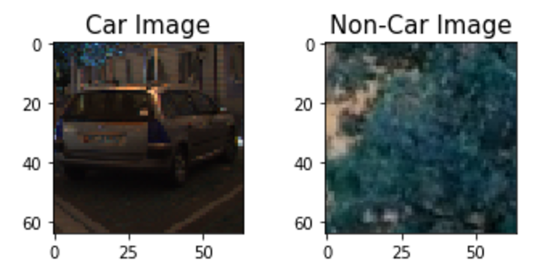
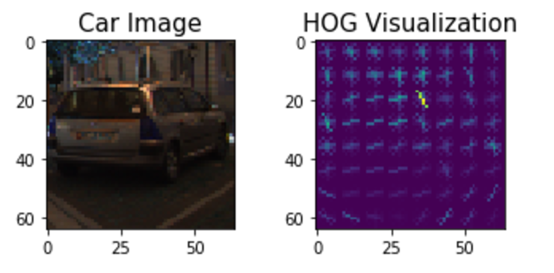
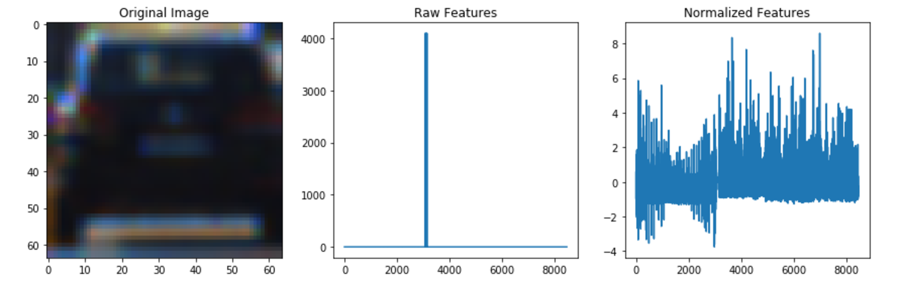
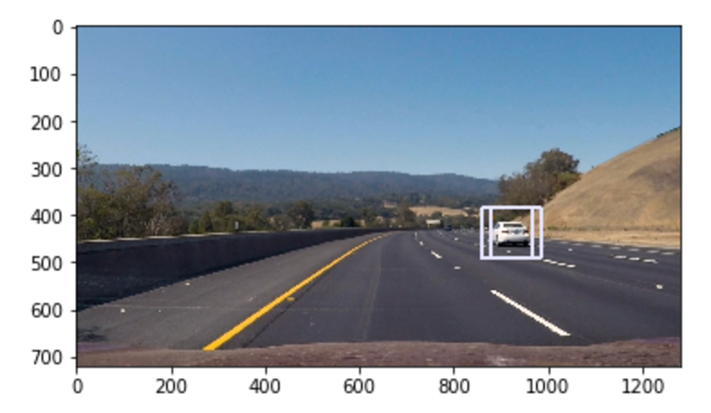
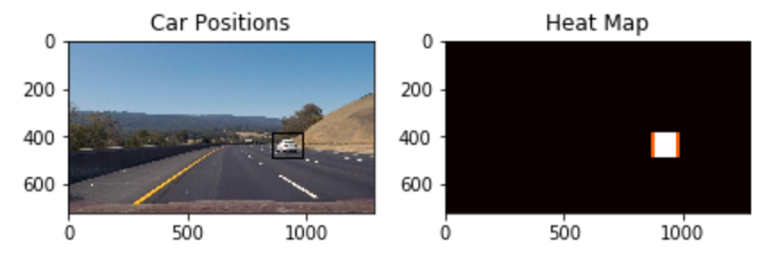

##Writeup Template

---

**Vehicle Detection Project**

The goals / steps of this project are the following:

* Perform a Histogram of Oriented Gradients (HOG) feature extraction on a labeled training set of images and train a classifier Linear SVM classifier
* Optionally, you can also apply a color transform and append binned color features, as well as histograms of color, to your HOG feature vector. 
* Note: for those first two steps don't forget to normalize your features and randomize a selection for training and testing.
* Implement a sliding-window technique and use your trained classifier to search for vehicles in images.
* Run your pipeline on a video stream (start with the test_video.mp4 and later implement on full project_video.mp4) and create a heat map of recurring detections frame by frame to reject outliers and follow detected vehicles.
* Estimate a bounding box for vehicles detected.

## [Rubric](https://review.udacity.com/#!/rubrics/513/view) Points
###Here I will consider the rubric points individually and describe how I addressed each point in my implementation.  

---
###Writeup / README

####1. Provide a Writeup / README that includes all the rubric points and how you addressed each one.  You can submit your writeup as markdown or pdf.  [Here](https://github.com/udacity/CarND-Vehicle-Detection/blob/master/writeup_template.md) is a template writeup for this project you can use as a guide and a starting point.  

### List of files
1. detection.ipynb - main file constructing the pipeline. Includes sample image of cars/non-cars visualization, sample HOF feature detection and visualization, feature extraction, train classifier, finally detect cars on sample images and test video.
2. utils.py - contains library functions for various operations like image visualization, HOG features extraction, heat map generation, etc. (mostly library functions provided in the course)
3. project_output_video_test_full.mp4 - final video with cars detected

###Histogram of Oriented Gradients (HOG)

####1. Explain how (and identify where in your code) you extracted HOG features from the training images.

The code for this step is contained in the code cell 5 of detection.ipynb.  
I started by reading in all the `vehicle` and `non-vehicle` images.  Here is an example of one of each of the `vehicle` and `non-vehicle` classes:

I then explored different color spaces and different `skimage.hog()` parameters (`orientations`, `pixels_per_cell`, and `cells_per_block`).  I grabbed random images from each of the two classes and displayed them to get a feel for what the `skimage.hog()` output looks like.

Here is an example using the grayscale image of a car and HOG parameters of `orientations=9`, `pixels_per_cell=(8, 8)` and `cells_per_block=(2, 2)`:

####2. Explain how you settled on your final choice of HOG parameters.

I tried various combinations of parameters and finally testing on the sample images settled on extracting HOG features for all 3 channels after converting the image to YCbCr format as it brings out the luminance and color components prominently.

Next, I extracted the histogram features and used a combination of histogram, spatial and HOG features as car identifiers. The features were normalized to be in similar range. Here is a sample image of a car template and its features.

####3. Describe how (and identify where in your code) you trained a classifier using your selected HOG features (and color features if you used them).

I trained a linear SVM using the LinearSVC function from sklearn (cell 10 in detection.ipynb). The training samples were car and non-car template features extracted as discussed above.

###Sliding Window Search

####1. Describe how (and identify where in your code) you implemented a sliding window search.  How did you decide what scales to search and how much to overlap windows?

Given an image, I implemented sliding window search using the following steps (last few cells of jupyter.ipynb with appropriate headings):

1. I extracted the region of interest where cars are most likely to be present. 
2. I calculated the HOG features for the entire ROI 
3. I implemented a sliding window on the ROI to calculate histogram and spatial features. The HOG features calculated in step 2 were scaled to extract the HOG features for each window. I used YCbCr HOG features with (8x8) pixels per cell, (2x2) cells per block, 9 orientations and 75% overlap of adjacent windows (each window starts on a cell boundary).
4. The window size was fixed to 64 but an additional scale was used to resize the image region of interest. A scale of 1.0 implies a search window of 64 pixels in the original image; higher scale factor implies bigger search window.

Here is an example of how the above method works in detecting a car in a sample image. Here I have used a scale of 1.2. Note that 2 windows have been detected here.

Eventually, I used a heat map based approach as discussed in the course to weed out false positives and get a tighter window bound for cars. The approach identifies bounding boxes based on a voting mecahnism of pixels belonging to multiple bounding boxes.

Ultimately I searched on three scales (1.5, 1.75, 1.95) using YCrCb 3-channel HOG features plus spatially binned color and histograms of color in the feature vector, which provided a nice result.  I used a threshold of 15 pixels for the heat map and a buffer of 20 recently used frames to get a consistent set of bounding boxes. Effectively, the heat map works on boxes detected in the 20 most recent frames and votes pixels which appear more than the threshold.

---

### Video Implementation

Here is a link to my final video. (project_output_video_test_full.mp4)
[https://github.com/uddipan/Udacity_SelfDriving/tree/master/Project5-VehicleDetection/project_output_video_test_full.mp4.mp4](./project_output_video_test_full.mp4)

####2. Describe how (and identify where in your code) you implemented some kind of filter for false positives and some method for combining overlapping bounding boxes.

I recorded the positions of positive detections in each frame of the video.  From the positive detections I created a heatmap and then thresholded that map to identify vehicle positions.  I then used `scipy.ndimage.measurements.label()` to identify individual blobs in the heatmap.  I then assumed each blob corresponded to a vehicle.  I constructed bounding boxes to cover the area of each blob detected. The exact threshold used and details are as in the previous section.

Here's an example result showing the heatmap from a video frame, the result of `scipy.ndimage.measurements.label()` and the bounding boxes then overlaid on the frame:

### Here is the frame and its corresponding heatmap:

---

###Discussion

####1. Briefly discuss any problems / issues you faced in your implementation of this project.  Where will your pipeline likely fail?  What could you do to make it more robust?

I tried various thresholds to weed out false positives. Increasing the threshold succesfully eliminates false positives, but at times fails to identify true cars. The false positives are mainly due to cars approaching from the other direction. 

The pipeline will be challenged if we have vehicles other than cars (e.g. trucks) and also  at night where the typical brightness will be different than the trained images. In order to make it more robust we can add more data to the training set collected at various times of the day. 

The pipeline will also likely fail if we have advertisement hoardings on the roadside with lots of color or even when the camera sees cars crossing the road perpendicularly (e.g. the car is near an intersection and cars cross near perpedicualar to it). In both cases more data might help.

